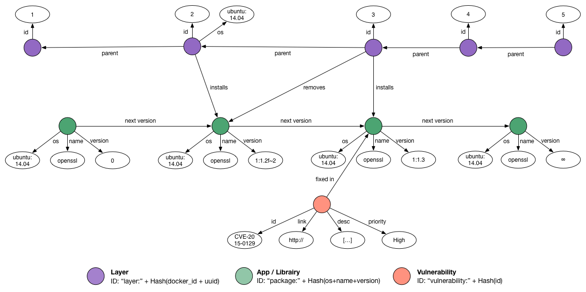

Clair
=====

Clair is a container vulnerability analysis service. It provides the list of vulnerabilities that threaten each container and can send notifications whenever new vulnerabilities that affect existing containers are released.

We named the project « Clair », which means in French *clear*, *bright*, *transparent* because we believe that it enables users to have a clear insight into the security of their container infrastructure.

## Why should I use Clair?

Clair is a single-binary server that exposes an JSON, HTTP API. It does not require any agent to sit on your containers neither does it need any specific container tweak to be done. It has been designed to perform massive analysis on the [Quay.io Container Registry](https://quay.io).

Whether you host a container registry, a continuous-integration system, or build dozens to thousands of containers, you would benefit from Clair. More generally, if you consider that container security matters (and, honestly, you should), you should give it a shot.

## How Clair Detects Vulnerabilities

Clair has been designed to analyze a container layer only once, without running the container. The analysis has to extract all required data to detect the known vulnerabilities which may affect a layer but also any future vulnerabilities.

Detecting vulnerabilities can be achieved by several techniques. One possiblity is to compute hashes of binaries. These are presented on a layer and then compared with a database. However, building this database may become tricky considering the number of different packages and library versions.

To detect vulnerabilities Clair decided to take advantage of package managers, which quickly and comprehensively provide lists of installed binary and source packages. Package lists are extracted for each layer that composes of your container image, the difference between the layer’s package list, and its parent one is stored. Not only is this method storage-efficient, but it also enables us to scan a layer that may be used in many images only once. Coupled with vulnerability databases such as the Debian’s Security Bug Tracker, Clair is able to tell which vulnerabilities threaten a container, and which layer and package introduced them.

### Graph

Clair internally uses a graph, which has its model described in the [associated doc](docs/Model.md) to store and query data. Below is a non-exhaustive example graph that correspond to the following *Dockerfile*.

```
1.  MAINTAINER Quentin Machu <quentin.machu@coreos.com>
2.  FROM ubuntu:trusty
3.  RUN apt−get update && apt−get upgrade −y
4.  EXPOSE 22
5.  CMD ["/usr/sbin/sshd", "-D"]
```



The above image shows five layers represented by the purple nodes, associated with their ids and parents. Because the second layer imports *Ubuntu Trusty* in the container, Clair can detect the operating system and some packages, in green (we only show one here for the sake of simplicity). The third layer upgrades packages, so the graph reflects that this layer removes the previous version and installs the new one. Finally, the graph knows about a vulnerability, drawn in red, which is fixed by a particular package. Note that two synthetic package versions exist (0 and ∞): they ensure database consistency during parallel modification. ∞ also allows us to define very easily that a vulnerability is not yet fixed; thus, it affects every package version.

Querying this particular graph will tell us that our image is not vulnerable at all because none of the successor versions of its only package fix any vulnerability. However, an image based on the second layer could be vulnerable.

### Architecture

Clair is divided into X main modules (which represent Go packages):

- **api** defines how users interact with Clair and exposes a [documented HTTP API](docs/API.md).
- **worker** extracts useful information from layers and stores everything in the database.
- **updater** periodically updates Clair's vulnerability database from known vulnerability sources.
- **notifier** dispatches [notifications](docs/Notifications.md) about vulnerable containers when vulnerabilities are released or updated.
- **database** persists layers information and vulnerabilities in [Cayley graph database](https://github.com/google/cayley).
- **health** summarizes health checks of every Clair's services.

Multiple backend databases are supported, a testing deployment would use an in-memory storage while a production deployment should use [Bolt](https://github.com/boltdb/bolt) (single-instance deployment) or PostgreSQL (distributed deployment, probably behind a load-balancer). To learn more about how to run Clair, take a look at the [doc](docs/Run.md).

#### Detectors & Fetchers

Clair currently supports three operating systems and their package managers, which we believe are the most common ones: *Debian* (dpkg), *Ubuntu* (dpkg), *CentOS* (yum).

Supporting an operating system implies that we are able to extract the operating system's name and version from a layer and the list of package it has. This is done inside the *worker/detectors* package and extending that is straightforward.

All of this is useless if no vulnerability is known for any of these packages. The *updater/fetchers* package defines trusted sources of vulnerabilities, how to fetch them and parse them. For now, Clair uses three databases, one for each supported operating system:
- [Ubuntu CVE Tracker](https://launchpad.net/ubuntu-cve-tracker)
- [Debian Security Bug Tracker](https://security-tracker.debian.org/tracker/)
- [Red Hat Security Data](https://www.redhat.com/security/data/metrics/)

Using these distro-specific sources gives us confidence that Clair can take into consideration *all* the different package implementations and backports without ever reporting anything possibly inaccurate.

# Coming Soon

- Improved performances.
- Extended detection system
  - More package managers
  - Generic features such as detecting presence/absence of files
  - ...
- Expose more informations about vulnerability
  - Access vector
  - Acess complexity
  - ...

# Related links

- Talk @ ContainerDays NYC 2015 [[Slides]](https://docs.google.com/presentation/d/1toUKgqLyy1b-pZlDgxONLduiLmt2yaLR0GliBB7b3L0/pub?start=false&loop=false&slide=id.p) [[Video]](https://www.youtube.com/watch?v=PA3oBAgjnkU)
- [Quay](https://quay.io): First container registry using Clair.
